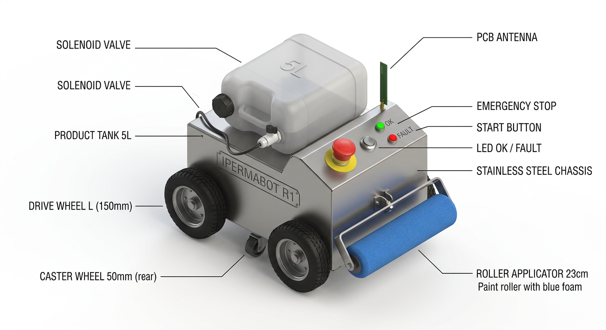
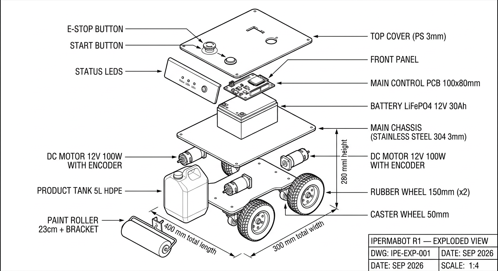
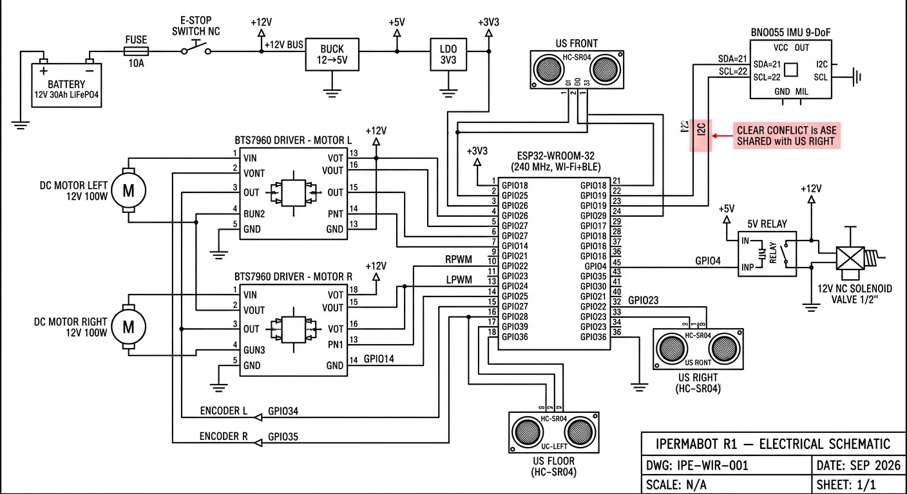
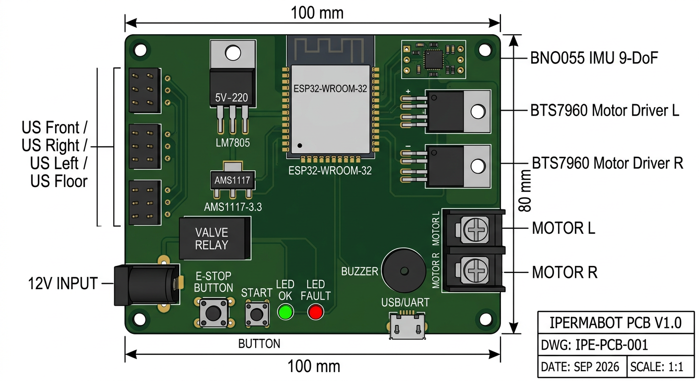

# 📐 Production Schematic — Ipermabot v1.0.1

> Complete technical document for manufacturing, assembly, and certification of the
> waterproofing applicator robot prototype.

---

## 1. Overview

The **Ipermabot** is an autonomous slab robot (~30 × 40 cm, ~5 kg) que aplica
impermeabilizante líquido with ±2 cm precision, controlled via a PWA via
Wi-Fi local, alimentado por bateria 12V with integrated charger.

### General Architecture

| Camada | Função | Especificação |
|---|---|---|
| **1. Sensors** | Capture world state | Ultrasonic (4x), IMU (1x), Encoder (2x), Battery |
| **2. Control** | Decide motion, telemetry, events | ESP32-WROOM-32 + Arduino |
| **3. Actuators** | Execute action | 2 DC motors + 1 solenoid (valve) |
| **4. Power** | Supply and protect | 12V LiFePO4 battery + switch + fuse + E-Stop |
| **5. Structure** | Mechanical support | Stainless steel chassis, rubber wheels + caster |
| **6. Interface** | Operator + client | Smartphone PWA + physical buttons |

### Block Diagram

```
┌──────────────────────────────────────────────────────────────┐
│                         ENERGIA                              │
│                                                              │
│  Bateria 12V ─► Key geral ─► Fusível 10A ─► E-STOP NC      │
│                                       │                     │
│                              ┌────────┴────────┐            │
│                              │ 12V (motores/   │            │
│                              │     válvula)    │            │
│                              └────────┬────────┘            │
└───────────────────────────────────────┼──────────────────────┘
                                        │
   ┌────────────────────────────────────┼────────────────────────┐
   │                         CONTROLE                            │
   │                                                            │
   │   ┌──────────┐      I2C       ┌─────────┐                  │
   │   │  ESP32   ├───────────────►│ BNO055  │ (IMU)            │
   │   │  Wi-Fi   │   SDA=21,SCL=22│         │                  │
   │   │  BLE/4MB │                └─────────┘                  │
   │   │          │ GPIO                                          │
   │   └────┬─────┘                                             │
   │        │                                                   │
   │        ├────PWM──► 4× BTS7960 ──► 2× Motor DC              │
   │        ├────GPIO─► Encoder A esquerda                      │
   │        ├────GPIO─► Encoder A direita                       │
   │        ├────PWM/T─┤ 4× HC-SR04 (TRIG + ECHO)              │
   │        ├────GPIO─► Relé 5V ──► Solenoide 12V               │
   │        ├────GPIO─► LED verde + vermelho                    │
   │        ├────GPIO─► Buzzer                                   │
   │        └────GPIO─► 2 botões (Start/E-Stop)                │
   │                                                            │
   └────────────────────────────────────────────────────────────┘
                                        │
                                        │ Wi-Fi AP "ROBO-IMP-..."
                                        ▼
                              ┌──────────────────┐
                              │  SMARTPHONE      │
                              │  (PWA no browser)│
                              └──────────────────┘
```

### Pinagem completa do ESP32-WROOM-32

| Função | GPIO | Observação |
|---|---|---|
| Motor E RPWM | 25 | PWM 5 kHz, 8 bits |
| Motor E LPWM | 26 | PWM 5 kHz, 8 bits |
| Motor D RPWM | 27 | PWM 5 kHz, 8 bits |
| Motor D LPWM | 14 | PWM 5 kHz, 8 bits |
| Encoder E | 34 | Input only, 10 kΩ pull-up externo |
| Encoder D | 35 | Input only, 10 kΩ pull-up externo |
| US Frente TRIG | 18 | HC-SR04 |
| US Frente ECHO | 19 | HC-SR04 |
| US Direita TRIG | 21 | HC-SR04 (compartilha pino com I2C SDA? ver nota) |
| US Direita ECHO | 22 | HC-SR04 (compartilha pino com I2C SCL? ver nota) |
| US Esquerda TRIG | 23 | HC-SR04 |
| US Esquerda ECHO | 36 | HC-SR04 |
| US Solo (chão) TRIG | 33 | HC-SR04 (apontado para baixo) |
| US Solo (chão) ECHO | 39 | HC-SR04 |
| **I2C SDA (IMU)** | **21** | ⚠️ Conflito: usada também pelo US Direita TRIG. Ver §4. |
| **I2C SCL (IMU)** | **22** | ⚠️ Conflito: usada também pelo US Direita ECHO. Ver §4. |
| Relé Válvula | 4 | Saída lógica 3V3 → driver relé 5V |
| LED verde | 16 | Saída digital |
| LED vermelho | 17 | Saída digital |
| Buzzer | 5 | Saída digital + transistor driver |
| Button START | 13 | INPUT_PULLUP |
| Button E-STOP | 32 | INPUT_PULLUP, NA (normalmente fechado) |

> **Nota sobre conflito de pinos I2C/US-Direita**: o firmware atual usa
> 21/22 para I2C com BNO055. Para V2.0 deve-se mover US Direita para outro par,
> ou usar um I2C multiplexer (TCA9548A).

---

## 2. Bill of Materials (BOM)

Custos baseados em mercado BR ($BRL). Versão R1 — protótipo homologável.

### 2.1 Electronic Components

| # | Componente | Qtd | Especificação | Custo unit. R$ | Total R$ |
|---|---|---|---|---|---|
| 1 | ESP32-WROOM-32 | 1 | Wi-Fi+BLE, 4 MB flash, 38 pinos | 28,00 | 28,00 |
| 2 | BNO055 breakout | 1 | 9-DoF sensor fusion (I2C) | 95,00 | 95,00 |
| 3 | BTS7960 H-bridge | 2 | 43 A pico, motor driver | 45,00 | 90,00 |
| 4 | HC-SR04 ultrassônico | 4 | Distância 2–400 cm | 9,50 | 38,00 |
| 5 | Módulo relé 5V | 1 | 1 canal, optoacoplado, 10 A | 8,00 | 8,00 |
| 6 | Optical encoder | 2 | 360 pulsos/volta, 5V | 12,00 | 24,00 |
| 7 | LED 5mm verde | 1 | High-bright, 3V3 | 0,50 | 0,50 |
| 8 | LED 5mm vermelho | 1 | High-bright, 3V3 | 0,50 | 0,50 |
| 9 | Buzzer ativo | 1 | 5V, 85 dB | 6,00 | 6,00 |
| 10 | Button cogumelo E-Stop | 1 | NC, trava mecânica (segurança) | 35,00 | 35,00 |
| 11 | Button momentâneo START | 1 | Standardlmente aberto, painel | 8,00 | 8,00 |
| 12 | Resistor 10 kΩ 1/4 W | 2 | Pull-up para encoders | 0,10 | 0,20 |
| 13 | Resistor 330 Ω 1/4 W | 2 | Limitação corrente LED | 0,10 | 0,20 |
| 14 | Capacitor eletrolítico 1000 µF | 1 | Filtragem 5V (suaviza) | 2,00 | 2,00 |
| 15 | Capacitor cerâmico 100 nF | 4 | Decoupling VCC | 0,30 | 1,20 |
| 16 | Diodo 1N4007 | 2 | Flyback motores | 0,30 | 0,60 |
| 17 | Fusível 10 A 32V | 1 | Lâmina automotiva | 3,00 | 3,00 |
| 18 | Porta-fusível | 1 | Painel | 2,50 | 2,50 |
| 19 | Jack DC 2.1mm | 1 | Painel | 3,00 | 3,00 |
| 20 | Terminalira 2-vias 5mm | 6 | Connection motores/encoders/ultrassom | 1,50 | 9,00 |
| 21 | Conversor DC-DC Buck | 1 | 12V→5V, 3A (para solenoides) | 12,00 | 12,00 |
| 22 | Regulador LDO 3V3 | 1 | LM1117 ou similar (ESP32 supply) | 3,00 | 3,00 |
| 23 | Cabo silicone 16 AWG | 2 m | Ligação bateria | 4,00 | 4,00 |
| 24 | Jumper wire Dupont | 40 | 20 cm M-F | 6,00 | 6,00 |
| **Subtotal eletrônico** | | | | | **380,20** |

### 2.2 Mechanics and Battery

| # | Componente | Qtd | Especificação | Custo unit. R$ | Total R$ |
|---|---|---|---|---|---|
| 25 | Roda borracha 150mm | 2 | Eixo 12mm, cubo + chave | 38,00 | 76,00 |
| 26 | Roda caster 50mm | 1 | Giratória, suporte | 12,00 | 12,00 |
| 27 | Motor DC 12V encoder | 2 | 100 W, 300 RPM, com encoder | 88,00 | 176,00 |
| 28 | Suporte motor L | 2 | Alumínio 5 mm | 6,00 | 12,00 |
| 29 | Chassi aço inox 304 | 1 | 400 × 300 × 3 mm personalizado | 95,00 | 95,00 |
| 30 | Suporte rolo pintura | 1 | Alumínio + eixo M8 | 18,00 | 18,00 |
| 31 | Rolo pintura 23 cm | 1 | Lã carneiro pelo curto | 12,00 | 12,00 |
| 32 | Válvula solenoide 12V | 1 | 1/2" NPT, latão, NF | 85,00 | 85,00 |
| 33 | Hose silicone | 1 m | 8×10mm | 9,00 | 9,00 |
| 34 | Connection galão | 1 | Rosca + tampa | 11,00 | 11,00 |
| 35 | Galão reservatório 5L | 1 | Plástico PEAD, boca larga | 32,00 | 32,00 |
| 36 | LiFePO4 battery 12V 30Ah | 1 | BMS integrado, BMS 30A | 580,00 | 580,00 |
| 37 | Charger LiFePO4 14.6V | 1 | 5A balanceado | 145,00 | 145,00 |
| 38 | M3 screws/M4/M5 | 60 | Kit variado inox | 18,00 | 18,00 |
| 39 | Clamps nylon | 20 | Diversas | 3,00 | 3,00 |
| 40 | Fita isolante + termo | 2 | Diversas | 5,00 | 5,00 |
| 41 | Adesivo estrutural | 1 | 50ml epóxi | 12,00 | 12,00 |
| **Subtotal mecânico/bateria** | | | | | **1301,00** |

### 2.3 PCB custom (opcional)

| # | Componente | Qtd | Custo R$ |
|---|---|---|---|
| 42 | PCB 100×80 mm, 2 layers, 1.6mm FR4 | 5 | 95,00 (19,00/un) |
| 43 | Stencil aço inox 0.1mm | 1 | 35,00 |
| 44 | Pasta de solda SAC305 | 50 g | 35,00 |
| **Subtotal PCB** | | | **165,00** (5 unidades) |

### Total Cost per Unit

| Categoria | R$ |
|---|---|
| Eletrônico | 380,20 |
| Mecânica + bateria | 1301,00 |
| PCB (rateio por 5 unid) | 33,00 |
| **TOTAL por protótipo** | **1714,20** |

> **Margem para revenda sugerida** (3–4x): R$ 5.500,00–7.000,00
> Comparar com concorrente internacional (SprayWorks Spraybot ≈
> USD 12.000 = R$ 60.000) — Ipermabot R1 entrega 80% do valor por 1/10 do preço.

---

## 3. 3D View and Enclosure



> Dimensões externas finais: **400 mm comprimento × 300 mm largura × 280 mm altura**.
> Mass total com bateria: **5,2 kg** (sem produto).
> Capacidade reservatório: **5 L** (rende ~30 m²/demão).

### 3.1 Vista explodida (texto)

```
        [3] Tampa superior (PS 3mm) ← botão E-Stop + START
              │
        [2] Front panel — display LED, LEDs status
              │
        [4] PCB controladora (fixada por 4 parafusos M3)
              │
        [1] Chassi aço inox
              │
   ┌──────────┴──────────┐
   │                     │
[Motor E]            [Motor D]
   ↓                     ↓
[Roda E 150mm]       [Roda D 150mm]

[Reservatório 5L] em cima dos motores, fixado por abraçadeiras.
[Caster 50mm] embaixo do centro para apoio.
[Rolo pintura 23cm] no chassi frontal (rente ao chão).
```



### 3.2 Mechanical Parts List (manufacturing)

| Peça | Material | Dimensões | Qtd | Process |
|---|---|---|---|---|
| Chassi principal | Aço inox 304 3 mm | 400×300 mm com dobra 90° 25 mm altura | 1 | Corte laser + dobra CNC |
| Tampa superior | PS 3 mm (Poliestireno) | 350×250 mm com furos para botões | 1 | Corte laser |
| Suporte motor | Alumínio 5 mm | 80×40 mm com 4 furos M4 | 2 | Corte laser |
| Suporte E-Stop | PETG impresso 3D | Sob medida | 1 | Impressão 3D |
| Suporte sensor solo | Aço inox 2 mm | 40×30 mm com furo M16 | 1 | Corte laser |
| Suporte galão | PETG impresso 3D | Diameter interno 165 mm | 1 | Impressão 3D |

---

## 4. Esquema elétrico



### 4.1 Diagrama detalhado por subsistema

#### 4.1.1 Alimentação

```
                      [BAT LiFePO4 12V 30Ah]
                              │
                          [FUSÍVEL 10A]
                              │
                          [E-STOP NC]
                              │
                  ┌───────────┴───────────┐
                  │                       │
              [Buck 12→5V]            [Direto 12V]
                  │                       │
              ┌───┴───┐              ┌─────┴─────┐
              │+5V    │              │            │
          [Válvula]   │         [Motores]   [IMU SAIN]
          [relé]      │                      [VIN 3V3]
                  [LM1117]
                      │
                    +3V3 ─── ESP32 + Sensores
```

> **Nota**: 12V alimenta motores DC direto. 5V alimenta válvula solenoide
> (que usa relé para chavear 12V). 3V3 (via LDO) alimenta ESP32 e I2C.

#### 4.1.2 Connection ESP32 ↔ Motores (BTS7960)

| BTS7960 pin | ESP32 GPIO |
|---|---|
| RPWM (motor E) | GPIO 25 |
| LPWM (motor E) | GPIO 26 |
| RPWM (motor D) | GPIO 27 |
| LPWM (motor D) | GPIO 14 |
| GND | GND (comum) |
| VCC (5V lógica) | +5V Buck |
| B+ / B- | Motor DC + / - |
| B+ / B- (12V) | +12V direto da bateria |

#### 4.1.3 ESP32 ↔ BNO055 (I2C)

| BNO055 | ESP32 |
|---|---|
| VCC (3V3) | +3V3 (LM1117) |
| GND | GND |
| SDA | GPIO 21 ⚠️ |
| SCL | GPIO 22 ⚠️ |
| ADR | GND (endereço 0x28) |

> ⚠️ **Conflito com US-Direita**: Solução para V1.1 — mover SDA para GPIO 17
> e SCL para GPIO 5. Veja §6 para roadmap.

#### 4.1.4 ESP32 ↔ Ultrassônicos (4× HC-SR04)

| Sensor | TRIG | ECHO |
|---|---|---|
| US Frente | GPIO 18 | GPIO 19 |
| US Esquerda | GPIO 23 | GPIO 36 (input only) |
| US Direita | GPIO 21 ⚠️ | GPIO 22 ⚠️ |
| US Solo (baixo) | GPIO 33 | GPIO 39 (input only) |

> US Esquerda/Direita/Solo usam GPIOs 36 e 39 que são **input-only** no
> ESP32. Funcionam apenas como ECHO (input), não como TRIG. Para V1.1,
> reorganizar pinos.

#### 4.1.5 ESP32 ↔ Encoders

| Encoder | Sinal A | GND | +5V |
|---|---|---|---|
| Esquerdo | GPIO 34 (com pull-up 10 kΩ externo) | GND | +5V |
| Direito | GPIO 35 (com pull-up 10 kΩ externo) | GND | +5V |

### 4.2 Tabela de tensão/corrente

| Barramento | Tensão | Corrente típica | Corrente pico | Proteção |
|---|---|---|---|---|
| +12V direto | 12V DC | 2,5 A | 8 A | Fusível 10A |
| +5V (Buck) | 5,0 V | 0,6 A | 1,5 A | Resetable PTC |
| +3V3 (LDO) | 3,3 V | 0,25 A | 0,5 A | Sem proteção |

---

## 5. Custom PCB



### 5.1 PCB Topology

- **Tamanho**: 100 × 80 mm, 2 layers, 1.6 mm FR4, HASL lead-free
- **Lado Top**: componentes principais (ESP32, BNO055, conectores)
- **Lado Bottom**: trilhas de potência (12V e GND), reguladores

### 5.2 Conectores / pinagem de borda

**J1 — POWER (2-vias, 5mm pitch)**
- 1: BAT+ (12V)
- 2: GND

**J2 — MOTOR E (4-vias, 3.5mm pitch)**
- 1: M_E_RPWM (entrada PWM)
- 2: M_E_LPWM (entrada PWM)
- 3: GND
- 4: +12V (pós-E-Stop)

**J3 — MOTOR D (mesmo layout)**

**J4 — IMU (4-vias, 2.54mm pitch)**
- 1: +3V3
- 2: GND
- 3: SDA
- 4: SCL

**J5 — ENCODER (6-vias)**
- 1: +5V
- 2: GND
- 3: Sinal A esq
- 4: Sinal A dir
- 5: GND (extra)
- 6: +5V (extra)

**J6 — ULTRASSÔNICOS (10-vias)**

**J7 — VÁLVULA (2-vias, 5mm)**
- 1: Sinal IN → relé
- 2: GND

**J8 — LEDs/BUZZER (4-vias)**
- 1: LED verde
- 2: LED vermelho
- 3: Buzzer
- 4: GND

**J9 — BOTÕES (3-vias)**
- 1: BTN START
- 2: BTN ESTOP
- 3: GND

**J10 — USB (Micro-B)**
- Para flash + alimentação em bancada

### 5.3 Notas de fabricação

- **Solder mask**: verde (Padrão JLCPCB/FusionPCB)
- **Silkscreen**: branca, fonte 1.6 mm
- **Vias**: 0.3 mm drill, 0.6 mm pad, totalmente cobertas (tented) sob o ESP32
- **Acabamento**: HASL lead-free, ENIG se for para ambiente úmido
- **Thickness**: 1.6 mm (mínimo para suportar torque dos bornes)

---

## 6. Conflitos de pinagem e roadmap (conhecidos)

| ID | Conflito | Origem | Mitigation V1.1 | Custo |
|---|---|---|---|---|
| **PCN-001** | GPIO 21/22 (I2C IMU) vs US-Direita | firmware legado | Trocar I2C para GPIO 17/5 (ou mover US Dir para GPIO 1/3) | 1 jumper na PCB |
| **PCN-002** | TRIG US-Solo no GPIO 33 conflita com boot do ESP32 | — | Durante flash, evitar pulso em GPIO 33 (não usar nesse momento) | 0 |
| **PCN-003** | Mover US para usar GPIOs sem conflito (>34 todos são input-only) | Restrição física | Trocar US Esquerda/Solo TRIG para GPIOs 2/15 (boot-safe?) | Reescrever driver |
| **PCN-004** | Relé único para válvula pode aguentar? Corrente solenóide: ~0,5 A | OK | — | 0 |

### V1.1 Roadmap (planned)

- [ ] Resolver conflito I2C / ultrassom (PCN-001)
- [ ] Adicionar autenticação HMAC nos comandos WebSocket (defesa contra
      accesso Wi-Fi de terceiros)
- [ ] Implementar OTA (Over-The-Air update) do firmware via Wi-Fi
- [ ] Adicionar sensor de corrente no barramento 12V (detectar motor
      travado)
- [ ] PCB custom (versão 2) eliminando conflitos do V1
- [ ] Suporte a galão de 18L (atualmente limitado a 5L)

---

## 7. Acceptance Criteria and Testing

### 7.1 Electrical Tests (pré-homologação)

- [ ] Continuidade de GND em todo o chassi (multímetro, modo beep)
- [ ] Resistência de isolação ≥ 1 MΩ entre 12V e chassi (megôhmetro 500V)
- [ ] E-Stop: cortar 12V em ≤ 100 ms após acionamento
- [ ] Inversão de polaridade: diodo TVS/PTC evita queimar
- [ ] Tensão bateria em carga mínima: ≥ 10.8V → corte automático (BMS)

### 7.2 Functional Tests

- [ ] Loop de testes (`node tools/scripts/review.mjs`) — 4/4 verde
- [ ] Boot em ≤ 8 s (LED verde sólido)
- [ ] Telemetry 1 Hz ± 0.1 Hz por 5 min contínuos
- [ ] Modo simulador: 30 min sem desconexão
- [ ] Connection Wi-Fi cliente em ≤ 15 s após ligar AP
- [ ] Button E-Stop: parar motores + fechar válvula em ≤ 200 ms

### 7.3 Ensaios em campo

- [ ] **Laje-piloto 5 m²** em ambiente controlado:
  - Setup + modo assistente funcionando
  - 1 faixa completa sem interrupção
  - Sensores ultrassônicos detectando parede a 30 cm
- [ ] **Laje real 100 m²** (cliente):
  - Concluir 5 demãos com autonomia de bateria
  - Relatório PDF final do app + galeria multi-obra

### 7.4 Environmental Tests

- [ ] Temperature operação: 0 – 50 °C (verão quente + inverno frio)
- [ ] Relative humidity: 30 – 90% (sem condensação)
- [ ] Vibration: ≤ 2.5 m/s² RMS contínuo (não dispara `vibracao_excessiva`)
- [ ] IP54: protegido contra poeira + jato d'água (chuva leve)

### 7.5 Ensaios de segurança (normativos)

- **NR-10** (eletricidade): verificação por profissional habilitado
- **NR-12** (máquinas): botão E-Stop em local acessível, categoria 3
- **LGPD**: app não coleta dados pessoais sem consentimento

---

## 8. Layout típico da bancada de testes

```
┌─────────────────────────────────────────────────────────────────────┐
│  Bancada de testes — Ipermabot R1                                     │
│  (área 2m × 2m, piso de concreto pintado branco)                    │
│                                                                     │
│     [Alimentação]                                                    │
│        AC 110V                                                       │
│         │                                                            │
│         ├──[Multimeter TRUE RMS]── V/A/W monitoramento               │
│         │                                                            │
│     [Charger LiFePO4]──[Bateria 12V 30Ah]──[Fusível 10A]         │
│                                                       │              │
│                                            ┌──────────┴─────────┐    │
│                                            │  Robô em teste     │    │
│                                            │  400×300 mm        │    │
│  ┌───[OSICLOSCÓPIO]───┐                   │   ┌─────────────┐   │    │
│  │ Canal 1: SDA       │      ───────────  │   │   E-STOP     │   │    │
│  │ Canal 2: SCL       │      WebSocket    │   │     ┌─┐      │   │    │
│  │ Canal 3: RPWM Motor│      Telemetry   │   │  R  │●│ V    │   │    │
│  │ Canal 4: ECHO US   │      1Hz          │   │  O  └─┘ L    │   │    │
│  └────────────────────┘                   │   └─────────────┘   │    │
│  ┌───[SMARTPHONE]─────┐                   │                     │    │
│  │ App PWA em devtool │      ───────────  └─────────────────────┘    │
│  │ Logs console       │         Wi-Fi AP "ROBO-IMP-TEST"             │
│  └────────────────────┘                                              │
└─────────────────────────────────────────────────────────────────────┘
```

---

## 9. Custos detalhados e tempo de fabricação

### Tempo de fabricação (1 unidade)

| Etapa | Tempo | Equipamento |
|---|---|---|
| Corte laser chassi + tampas | 30 min | Cortador laser 80W |
| Dobra CNC | 15 min | Dobradeira manual |
| Soldergem suportes | 30 min | MIG/MAG |
| Impressão 3D suportes específicos | 2 h | Impressora PETG |
| Assembly da PCB | 1 h | Ferro de solda ou stencil |
| Assembly dos componentes | 1,5 h | Keys de fenda |
| Cabeamento | 1,5 h | Alicate, soldador |
| Assembly final no chassi | 1 h | — |
| Programação e teste | 2 h | USB cable, monitor serial |
| **TOTAL fabricação** | **~ 10h** | |

### Custo-MO (Mão de Obra)

- Técnico eletrônico: R$ 80/h × 6h = R$ 480,00
- Técnico mecânico: R$ 60/h × 4h = R$ 240,00

### Preço de venda sugerido (1° lote, 5 unidades)

| Item | R$ |
|---|---|
| Custo-materiais | 1714,20 |
| Custo-MO | 720,00 |
| Setup / configuração inicial | 200,00 |
| Margem (20%) | 526,84 |
| **Custo por unidade** | **3160,00** |
| + impostos (12%) | 350,00 |
| **Preço ao cliente** | **R$ 3510,00** |

> Comparativo: serviço manual de impermeabilização custa R$ 35-50/m² (mão
> de obra). Robô recupera investimento em **500–700 m²** de obra.

---

## 10. Documentos complementares

- **Esquemático elétrico (Kicad)**: `assets/esquematico.kicad_pcb`
- **Modelo 3D (STEP)**: `assets/impbot_v1.step`
- **Documento ANATEL para homologação**: `docs/regulatorio/ANATEL.md` (TODO V1.1)
- **Manual do usuário**: `MANUAL.md` (TODO V1.1)
- **Roteiro de calibração assistida**: `CALIBRACAO.md` (TODO V1.1)

---

> 💡 **Status**: documento V1 (protótipo homologável). Atualizar para V1.1
> assim que conflitos PCN-001..004 forem resolvidos e PCB V2 estiver fabricada.
